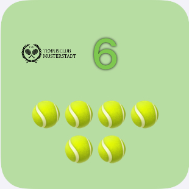
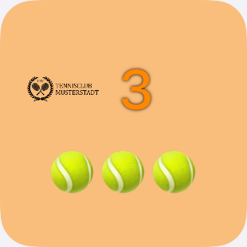
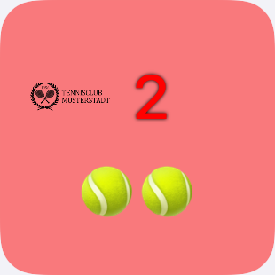
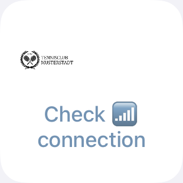
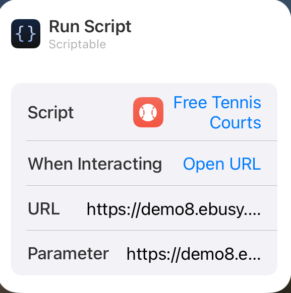

# :tennis: ebusy-free-courts-widget

This widget displays the currently available (tennis)-courts in your club, if they use the **eBuSy 8 Buchungssystem**.

The amount of available courts is colour coded based on the total amount of courts.

| green indicates that more than two thirds of the courts are available | orange indicates that more than one third of the courts are available | red indicates that less than one third of the courts are available |
|:----:|:----:|:----:|
|  |  |  |

If your phone has no internet connection or if the data could not be loaded from the website, the following widget screen is shown:
<p align="center">

</p>

## Requirements
* Apple Device with iOS 14.
* Scriptable latest (https://scriptable.app/).

## Setup
1. Copy the source code for ```ebusy-free-courts-widget.js``` ("raw").
2. Open Scriptable.
3. Select "+" and insert the copy of the script.
4. Choose the title of the script (e. g. Free Tennis Courts).
5. Save with "Done".
6. Go back to the iOS Homescreen and get into the "wiggle mode".
7. Press the "+" symbol and look for "Scriptable".
8. Choose widget size (small) and "Add widget".
9. Go into the settings of the widget to edit it.


</br>
</br>
</br>

* Choose script of step #4.
* Select when interacting "Run Script" or "Open URL".
  * In case "Open URL" was selected: Provide the URL of your club's eBuSy 8 Buchungssystem (e. g. ```https://demo8.ebusy.de/lite-module/920```)
* Provide 2 parameters separated by comma: first the URL of your club's eBuSy 8 Buchungssystem and then the amount of courts that can be booked (e. g. ```https://demo8.ebusy.de/lite-module/920,6```)

**Enjoy the widget!**
